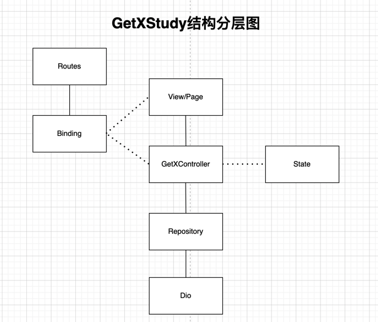
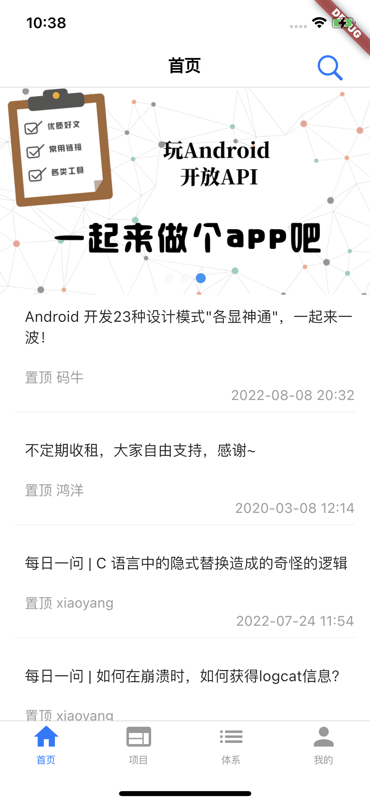
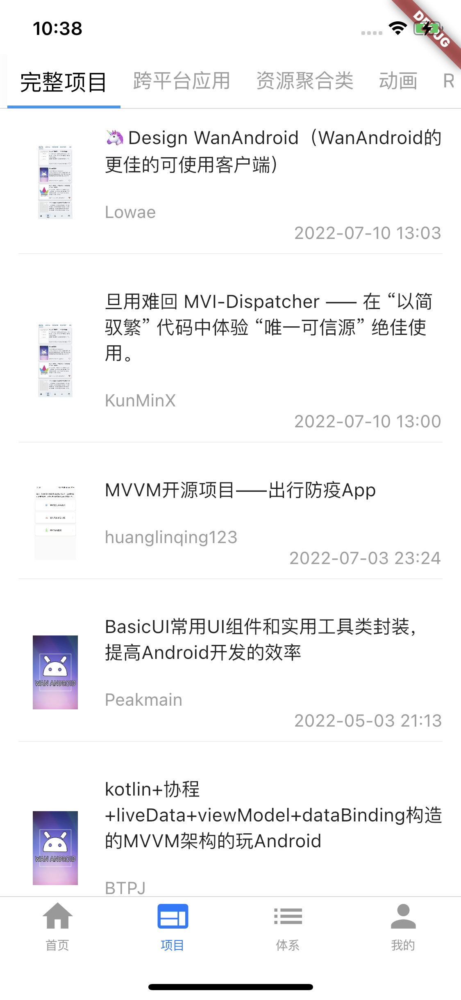
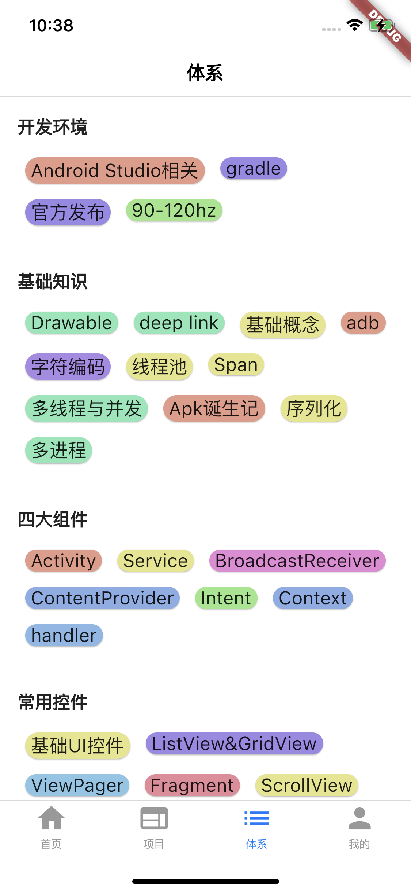
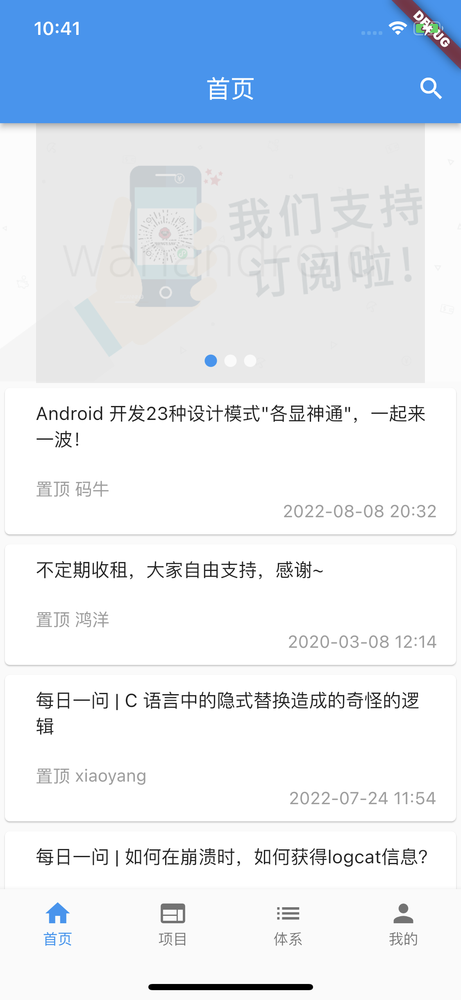
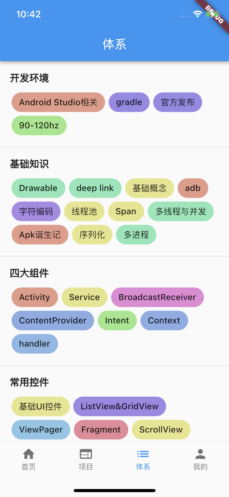
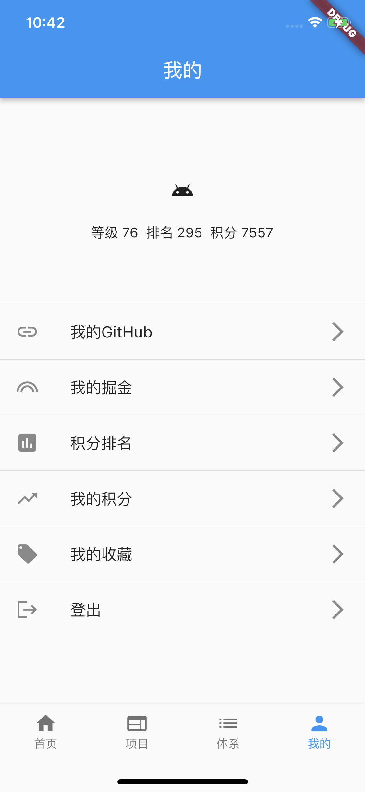

# 使用GetX编写Flutter的wanandroid客户端

## 前言

在编写完RxSwift的wanandroid客户端之后，我一直都在犹豫是否需要将Flutter的wanandroid客户端进行重构。

我早在19年的时候就开始接触Flutter，但是还停留在CV与照葫芦画瓢。比较系统的学习Flutter应该在20年的疫情期间，之后我通过网上的例子编写了这个项目——[FlutterPlayAndroid](https://github.com/seasonZhu/FlutterPlayAndroid)。

刚开始的时候学习Flutter，基本上都是很粗暴的使用setState进行页面刷新，UI与逻辑也是乱七八糟，不尽人意。

## 关于这个项目

这个项目我主要是通过GetX框架进行搭建，通过[WanAndroid开放API](https://www.wanandroid.com/)制作。

<div align="center">



</div>

本次重构，很多代码部分还是沿用之前的Flutter项目的逻辑，同时因为有RxSwift的使用经验，使得我在本次开发中对于响应式理解更加轻车熟路。

**注意，本项目目前只在iOS侧编译运行成功，Android端的情况目前还在调试，如果有问题，还欢迎大家指点一二。**

#### 界面截图

**Cupertino风格**

|  |  |  |  |
| --- | --- | --- | --- |

**Material风格**
|  |  |  |  |  
| --- | --- | --- | --- |
### 功能说明

* 首页、项目、体系、我的，四大模块
* 登录注册功能
* 搜索功能：热门搜索、输入搜索
* 文章列表
* Tab切换功能
* 自动轮播图
* 下拉刷新，上拉加载更多
* dio的使用，pretty_dio_logger进行漂亮的网络请求打印
* GetX的响应式编程，GetXController统和逻辑，Bindings进行统一注入
* Material和Cupertino两种风格切换，切换分支main与develop_cupertino即可

### 引入的第三库

```ruby
# GetX
get: ^4.6.5
# 轮播图
card_swiper: ^2.0.4
# WebView
webview_flutter: ^3.0.4
# 下拉刷新，上拉加载更多
pull_to_refresh: ^2.0.0
# 侧滑功能库
flutter_slidable: ^2.0.0
# 网络图片缓存库
cached_network_image: ^3.2.1
# 拼音转字符串
lpinyin: ^2.0.3
# 简单的数据存储库
shared_preferences: ^2.0.15
# 网络请求库
dio: ^4.0.6
# 网络请求日志
pretty_dio_logger: ^1.1.1
# 走马灯组件
marquee: ^2.2.3
# 吐司
flutter_easyloading: ^3.0.5
# 原生分享
share: ^2.0.4
# 网易开发的R函数，需要使用插件运行CLI进行
r_dart_library:
  git:
    url: 'https://github.com/YK-Unit/r_dart_library.git'
    ref: 0.4.1
# 暂时没有使用的库

# RxDart，感觉有GetX这个库没啥用
rxdart: ^0.27.5
# 图片选择器
image_picker: ^0.8.5+3
# URL跳转
url_launcher: ^6.1.5
# 图片保存
image_gallery_saver: ^1.7.1
# App沙盒路径
path_provider: ^2.0.11
# 总线，类似iOS的NotificationCenter，有了GetX之后，跨页面通信可以不用总线了
event_bus: ^2.0.0
# 通过原生打开文件
open_file: ^3.2.1
# 隐私权限
permission_handler: ^10.0.0
```

## GetX的感受

在Flutter端，我入门的时候根本不懂状态管理为何物，用的最多的是StatefullWidget，setState进行页面的刷新，但是随着不断的深入，我渐渐理解了Provider以及BLoc这些框架的意义与目的。

伴随着响应式在我编程中的深入，我也开始接触GetX。

其实Flutter中有RxDart，但是并没有与之对应的RxFlutter，你可以用响应式搭建逻辑，但是如何与UI进行绑定又是一个问题。

GetX很好的完成了任务，GetX其实更像一个全家桶，里面不仅仅有响应式，还有网络、路由、状态管理，以及一些常用工具。

当然使用GetX里面也有很多奇奇怪怪的坑，我遇到最多的就是GetXController要么没有创建，有么没有找到，但是GetX的好用也是显而易见的，它让你摆脱了context。

总之，GetX是一个有点不太符合Flutter风格的插件，摒弃了自顶而下的管理思路（需要注意的是，自顶而下这种思路其实普遍见于前端），通过Map形式保存Widget与对应的GetXController，其实并不算太新颖的思路，但是它的好处就是，即便你Flutter使用的不够溜，用GetX写逻辑很快就会找到熟悉的感觉，Get.put与Get.find简直就是召之即来挥之即去，使用是简单了，同时也需要小心翼翼，理解背后的原理。

说实话，Provider我觉得其实还是挺不错的，但是如BLoc、Redux，在我看来有的时候真的是异常复杂，理解不难，写起来贼费劲。

所以如果你还在入门Flutter，我觉得，从StatefullWidget到Provider，这才是一个正常的循序渐进的过程，响应式固然好，但是也是需要一步一个台阶向上的。

最后，你再来学习GetX，才会懂的其中的精妙。

**所谓一通百通，我也通过RxSwift与Vue尝试写了wanandroid客户端，也欢迎大家一起学习。**

## Swift版wanandroid客户端

[项目地址](https://github.com/seasonZhu/RxStudy)

## uni-app版wanandroid客户端

[项目地址](https://github.com/seasonZhu/UniAppPlayAndroid)

## 我的掘金主页

[我的主页](https://juejin.cn/user/4353721778057997)